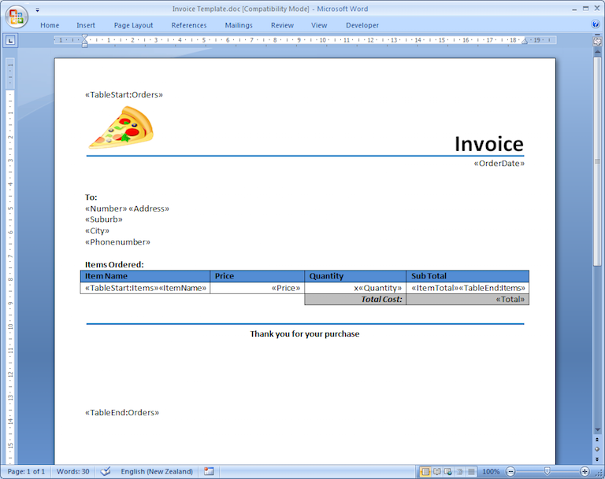
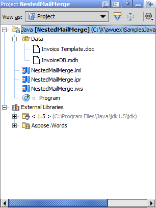
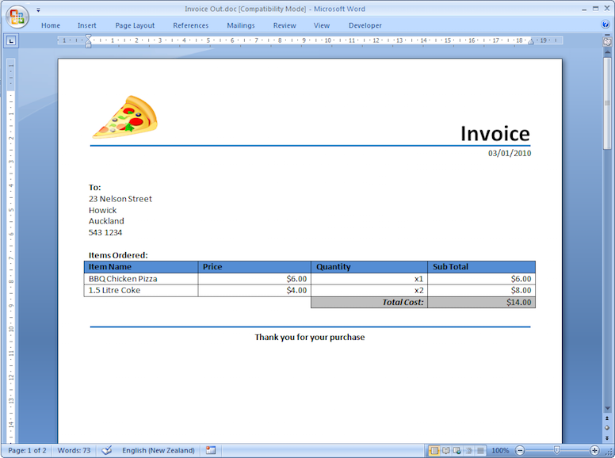
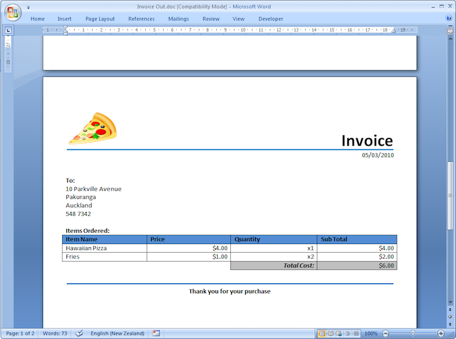

## **How to Use Nested Mail Merge Regions**
Most data in relational databases or XML files is hierarchical (e.g. with parent-child relationships). The most common example is an invoice or an order containing multiple items.

Aspose.Words allow nesting mail merge regions inside each other in a document to reflect the way the data is nested and this allows you to easily populate a document with hierarchical data.

This article details the steps of how to set up a working nested mail merge application to generate a collection of invoices where each contains multiple items. An example project with complete source code and files can be downloaded. The process and code will be explained step by step and common issues addressed at the end of the article.
### **What are Nested Mail Merge Regions and When Would I use Them?**

Nested mail merge regions are at least two regions in which one is defined entirely inside the other, so they are “nested” in one another. In a document it looks like this:

Just as in standard mail merge each region contains the data from one table. What’s different in nested mail merge is that the **Order** region has the **Item** region nested inside it. This makes the **Order** region the parent and the **Item** region the child. This means that when the data is merged from the data source, the regions will act just like a parent-child relationship where data coming from the **Order** table is linked to the **Item** table.

The example below shows the data being passed to the nested merge regions and the output that is generated by the merge. 

As you can see, each order from the **Order** table is inserted followed by each item from the **Item** table that is related to that order. Then the next order will be inserted along with their items until all the orders and items are listed.
#### **Step 1 – Create the Template**
This is the same process as creating a standard mail merge document with regions. Remember that with mail merge regions we can have the same field name in different regions so there is no need to change any column names. Here is what our Word template looks like:

There are a few things you need to consider when preparing nested mail merge regions and merge regions in general.

- The mail merge region opening and closing tag (e.g. TableStart:Order, TableEnd:Order) **both need to appear in the same row or cell.** For example, if you start a merge region in a cell of a table, you must end the merge region in the same row as the first cell.
- The names of the columns in the **DataTable must match** the merge field name. Unless you have specified mapped fields the merge will not be successful for those fields whose names are different.
- The opening and closing table tags **need to be well formed**. This means that the StartTable and EndTable table tags must match. An incorrectly formed region will cause all nested mail merge regions to stop displaying anything at all.

If one of these rules is broken the program may produce unexpected results or an exception may be thrown.
#### **Step 2 – Create the Data Source**
The data to be merged into the template can come from a variety of sources, mainly relational databases or XML documents. In our example we are going to use a Microsoft Access database to store our data and load each table from the database into DataTable objects. Nested mail merge will be executed using this DataSet.

The orders data is contained within the database as shown below. 

These files should be included in our project folder:

|****|
| :- |
#### **Step 3 – Ensure Correct Table Names and Relationships Exist Between Tables**
For Aspose.Words to perform nested mail merge correctly, the following requirements must be met:

1. The names of the mail merge regions in the document must match the **names of the DataTables** populated from the data source.
1. The nesting order of mail merge regions in the document must match the **data relationships between the tables** in the data source.

Since our data is coming from a database, the data is expected to be represented in a **ResultSet** object. Aspose.Words include special classes used when mail merging from data stored in **ResultSet** objects. Each **ResultSet** is wrapped into its own **DataTable** object. These **DataTable** objects are added to a **DataSet** and relations between each **DataTable** defined. This is the basis of how nested mail merge works.

For further information about setting up data, relations see the following article in the documentation [here](http://www.aspose.com/docs/display/wordsjava/How+to+Execute+Mail+Merge).
#### **Step 4 – Prepare the Code**
The code for setting up nested mail merge is simple to implement with Aspose.Words. Remember when setting up your project:

- To include the reference to Aspose.Words.
- Load each table from the data source into appropriate tables.
- Load the data into a DataSet object.

We create a [Document](http://www.aspose.com/api/java/words/com.aspose.words/classes/Document) object which loads our invoice template. Then Aspose.Words merges the data from our **DataSet** and fills the document with data. Then we save the results into a document in the desired format. Here is the complete code for our project:

Below example shows how to generate an invoice using nested mail merge regions.


#### **The End Result**
Here is the resulting Microsoft Word document produced after running the code:

Scrolling through the document produced you can see that the nested mail merge was successful. Each order’s details are generated including the corresponding items purchased.
### **Common Issues When Developing using Nested Mail Merge**
**Q:** When using nested mail merge, the generated output has no fields that are merged; instead the original name of the merge field just stays the same?
**A:** Check the data is being loaded properly into tables. The tables should have their TableName property set, a primary key, and a relationship defined.

Additionally, check that the merge fields are named properly. To do this press Alt+ F9 in Microsoft Word and make sure the name in the merge fields matches the columns in the tables. Try to use the following code in your project to ensure merge fields are being loaded in correctly. It gathers an array of strings that contain the names of the merge fields that are loaded into the document.

Below example shows how to get names of all merge fields in a document.

**Java**


String[] fieldNames = doc.getMailMerge().getFieldNames();


**Q:** The output of nested merging displays no data from the child table for the first entry in the parent table but displays all items for the last entry in the parent table, even ones that are not actually linked to it?
**A:** This happens when the merge regions in the template document are not correctly formed. Check step 1 of this documentation for information on the structure nested merge regions.
**Q**: Each entry from the parent table displays every item in the child table, even ones that are not actually linked to it?
**A:** This happens when the relationship between the parent and child tables are set up incorrectly or not at all. Check step 2 for information on how to setup a **DataRelation**.
