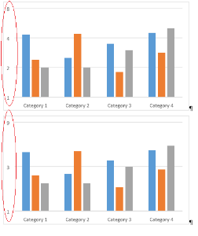
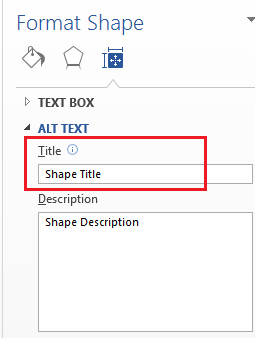

{} 

This page lists public API changes that were introduced in Aspose.Words 16.2.0. It includes not only new and obsoleted public methods, but also a description of any changes in the behavior behind the scenes in Aspose.Words which may affect existing code. Any behavior introduced that could be seen as a regression and modifies existing behavior is especially important and is documented here.

{} 
### **Fast Extraction of Plain Text from Flow-Format Documents Supported**
In order to support such usecases as fast search and indexing of documents, the following static methods were exposed on the Document class:

**Java**


public class Document
{
  ....
  public static PlaintextDocument ExtractText(String fileName) 
  public static PlaintextDocument ExtractText(String fileName, LoadOptions loadOptions) 
  public static PlaintextDocument ExtractText(Stream stream) 
  public static PlaintextDocument ExtractText(Stream stream, LoadOptions loadOptions)
   ....
}


All of the methods exposed above return the plain text representation of the document.

**Java**


/** 
 Contains plain-text representation of the document's content as extracted by <see cref="Document.ExtractText(string)"/> and alike.
*/
public class PlaintextDocument
{
 public String getText()
 public BuiltInDocumentProperties getBuiltInDocumentProperties()
 public CustomDocumentProperties getCustomDocumentProperties()
}


Presently the speed optimizations are done for DOCX and DOC.
RTF and WordML will hopefully be added in March 2016 along with further improvements for all flow-formats.
### **Font Substitution Improved**
WORDSNET-5907 has been resolved. Font substitution improved to mimic MS Word in case when font info in the document doesn't contains the PANOSE. Previously, in this case, Aspose.Words used to substitute fonts with FontSettings.DefaultFontName. In case when PANOSE is specified in font info, Aspose.Words still uses FontSettings.DefaultFontName.

Warning is issued with text: "Font '<font_name>' has not been found. Using '<substitution_name>' font instead. Reason: closest match according to font info from the document."
### **Axis Logarithmic Scale Supported during Rendering DML Chart**
WORDSNET-12130 has been resolved. Starting from 16.2.0 version, Aspose.Words supports axis logarithmic scale upon rendering DML chart.

### **PageSavingCallback Introduced for all Fixed-Page based Save Formats**
WORDSNET-12176 has been resolved. PageSavingCallback allows you to control how separate pages are saved when a document is exported to fixed-page based save formats. You are able to control PageFileName for each separate page. Or you can specify the stream where the document page will be saved using PageStream property.

**Java**


public void TestPageSavingCallbackHtmlFixed() throws Exception
{
    Document doc = new Document("Test.docx");
    HtmlFixedSaveOptions htmlFixedSaveOptions = new HtmlFixedSaveOptions();
    htmlFixedSaveOptions.setPageIndex(0);
    htmlFixedSaveOptions.setPageCount(doc.getPageCount());
    htmlFixedSaveOptions.setPageSavingCallback(new CustomPageFileNamePageSavingCallback()); 
    doc.save("out.html", htmlFixedSaveOptions);
}


**Java**


/*
 Custom PageFileName is specified.
*/
class CustomPageFileNamePageSavingCallback implements IPageSavingCallback
{
    @Override
    public void pageSaving(PageSavingArgs args)
    {
        // Specify name of the output file for the current page.
        args.setPageFileName(String.format("C:/Temp/Page_{0}.html", args.getPageIndex()));
    }
}


Or you can specify PageStream:

**Java**


/** 
Custom PageStream is specified.
*/
class CustomPageStreamPageSavingCallback implements IPageSavingCallback
{
	@Override
	public void pageSaving(PageSavingArgs args)
	{
		InputStream stream = new ByteArrayInputStream("".getBytes());
		args.setPageStream(stream);
		args.setKeepPageStreamOpen(true);
	}
}


PageSavingCallback is available for following classes:

- HtmlFixedSaveOptions
- ImageSaveOptions
- PdfSaveOptions
- PsSaveOptions
- SvgSaveOptions
- SwfSaveOptions
- XamlFixedSaveOptions
- XpsSaveOptions
### **Ability to Determine if a Run or a Paragraph has Format Changes Added**
WORDSNET-12499 has been resolved and the following property is added into the Inline and Paragraph classes:

**Java**


/** 
 Returns true if this object was formatted in Microsoft Word while change tracking was enabled.
*/
public boolean getIsFormatRevision()

### **Feature to Get-Set Alt Text Title Property of Shape Added**
WORDSNET-12918 has been resolved. Starting from 16.2.0 version, Aspose.Words starts supporting Alt Text Title.

In case of older format conversion MS Word formats following string "Title: titleText - Description: descText", if there is no description "Title: titleText", if there is no title then just "descText". Aspose.Words does the same now. And you can also get/set shape title like this: 

**Java**


Node[] shapes = doc.getChildNodes(NodeType.SHAPE, true).toArray();
Shape shape0 = (Shape)shapes[0];

// Get shape title.
System.out.println(shape0.getTitle());

// Set new shape title.
shape0.setTitle("New Shape Title");

