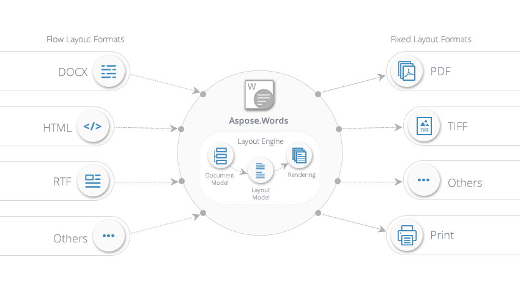

We use the term "rendering" in Aspose.Words to describe the process of converting a document into a file format or a medium that is paginated or has the concept of pages. We are talking about the rendering of a document into pages. The following diagram shows what rendering is in Aspose.Words.

The rendering features of Aspose.Words enable you to perform the following:

- Convert a document or selected pages to PDF, XPS, HTML, XAML, PostScript, and PCL formats.
- Convert a document into a multi-page TIFF document, or convert any page into a raster image and save it as BMP, PNG or JPEG.
- Convert a document page into a Scalable Vector Graphics image (SVG), or convert into a vector image and save it as EMF.
- Render (draw) a document page at a specific size or scale on the Graphics object to create thumbnails, full-sized or scaled images of document pages.
- Render a [Shape](https://apireference.aspose.com/java/words/com.aspose.words/Shape) object separately from the document to any image format or to a Graphics object.
- Display any page of a document in a Swing Component.
- Print or preview document pages using the standard Java printing infrastructure.

## **Flow-Layout or Fixed-Layout Document Formats**

All the document formats that can be loaded into Aspose.Words are known as “flow-layout” formats. Flow-layout formats include DOC, OOXML, RTF, ODT, and HTML. Documents in these formats consist of various elements such as paragraphs, tables, headers, footers, images, fields, and their formatting, for example, bold, italic, font, size. However, the flow-layout formats do not contain information about the position where each particular paragraph or character is displayed on a page.

In contrast, the “fixed-layout” (also known as "fixed page") formats such as PDF and XPS contain exact positioning information for all document elements. These formats preserve the original appearance of a document after it was laid out into pages, providing higher accuracy of the displayed information.

## **Page Layout Engine**

Aspose.Words implements its own page layout engine that formats a flow-layout document into pages. Aspose.Words implements a number of renderers that either produce a fixed-layout document such as PDF or XPS, or output pages into another medium such as printing or drawing. Note that the export can also be paginated for HTML and XAML. This means that a document can be saved as regular HTML or XAML (flow-layout format), or as "paginated" HTML and XAML that feature absolute positions of elements.

The most important advantage of using Aspose.Words page layout engine is that it mimics the way Microsoft Word’s page layout engine works. Therefore, when you convert a Microsoft Word document into PDF, XPS, or print it using Aspose.Words, the output will appear almost exactly as if it was done by Microsoft Word. Note that Aspose.Words does not utilize Microsoft Word.
