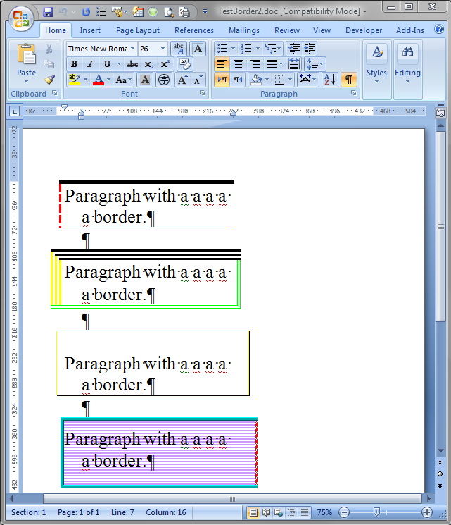
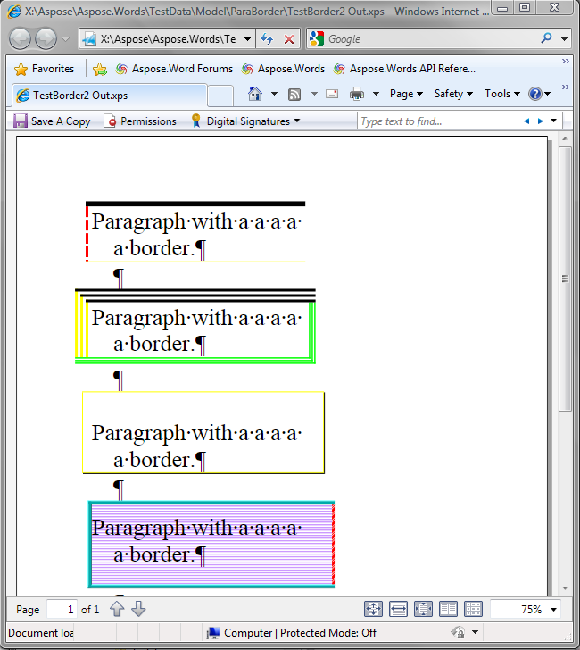

{} 

You can check the quality of Aspose.Words conversion and view the results online at this link:

<https://products.aspose.app/words/conversion>

{} 

## **About XPS**

The [XML Paper Specification](https://wiki.fileformat.com/page-description-language/xps/) is a page description language and a fixed-document format originally developed by Microsoft. Like PDF, XPS is a fixed-layout document format designed to preserve document fidelity and provide device-independent document appearance.

## **XPS in Aspose.Words**
Any document loaded into Aspose.Words can be converted to XPS.

Aspose.Words uses the same high-fidelity page layout and rendering engine to produce output in all its supported fixed-layout formats PDF, XPS, and SWF.

It is worthwhile to note that Aspose.Words generates XPS directly (including sub-setting of TrueType fonts), without relying on any external libraries, this allows Aspose.Words to produce XPS on literally nearly any machine that runs Java.

Based on the information specified in the original document, such as paper size, orientation, and paper tray (which, by the way, can be different for different sections), Aspose.Words creates and embeds XPS Print Tickets that conform to the [Print Schema](http://msdn.microsoft.com/en-us/windows/hardware/gg463387) specification. The print tickets will help the document print correctly, as the user intended.

The images below show the high degree of fidelity with which Aspose.Words has converted a document from DOC to XPS.

