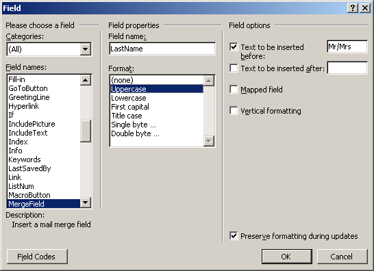
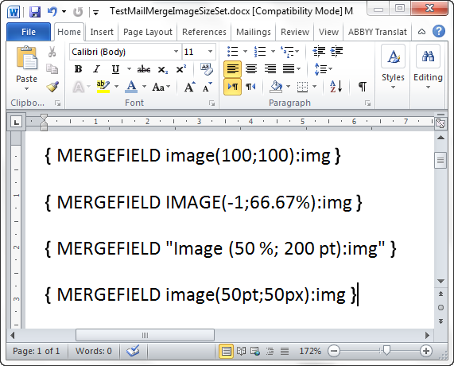
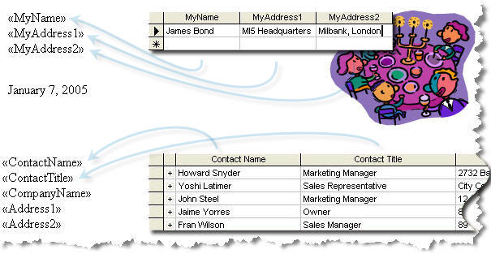
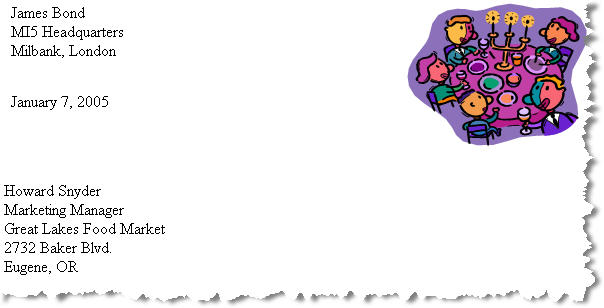

## **About Mail Merge in Aspose.Words**
Aspose.Words can generate documents from templates with mail merge fields. The data from an external source like a database or file is placed into these fields and formatted, and the resulting document is saved in the folder you specify. Mail Merge is a feature of Microsoft Word for quickly and easily creating documents like letters, labels and envelopes. Aspose.Words takes the standard mail merge and advances it many steps ahead, turning it into a full-fledged reporting solution that allows you to generate even more complex documents such as reports, catalogs, inventories, and invoices. The advantages of the Aspose.Words reporting solution are:

- Design reports in Microsoft Word, use standard mail merge fields.
- Define regions in the document that grow, such as detail rows of an order.
- Insert images during mail merge.
- Execute any custom logic, control formatting, or insert complex content using mail merge event handlers.
- Populate documents with data from any type of data source.
### **Basic Steps**
Steps to perform a mail merge are quite easy. First, you use Microsoft Word to create and design a Word document normally called a template. Note that the document does not have to be a Microsoft Word Template (.dot), it can be a normal .doc document. You insert some special fields called merge fields into the template in places where you want data from your data source to be later inserted.

Then you open the document in Aspose.Words and execute a mail merge operation. The mail merge operation will take data from your data source and merge it into the document. You can then save the document in Word binary format (.doc) or any other format supported by Aspose.Words. You can save it to a file or stream right to the client browser.

You can also designate repeatable merge regions in the document or insert special merge fields that allow you to insert other content such as images. Depending on how you set up mail merge fields and repeatable regions inside the document, the document will grow to accommodate multiple records in your data source. If you do not use mail merge regions, then the mail merge will be similar to Microsoft Word mail merge and the whole document content will be repeated for each record in the data source.

Using repeatable mail merge regions, you can designate portions inside a document that will be repeated for each record in the data source. For example, if you mark a table row as a repeatable region then this table row will be repeated, causing the table to dynamically grow to accommodate all of your data.
### **Data Sources**
Data can come from a source in a variety of formats supported by ADO.NET. It can be DataTable, DataView, DataSet, IDataReader or an array of values. If you have your data in XML format, then you can load it into a DataSet and merge with the DataSet. Aspose.Words also accepts ADO **Recordset** objects and exposes COM classes and interfaces so you can use it from within COM and scripting applications such as ASP applications. Finally, you can implement the [IMailMergeDataSource](http://www.aspose.com/api/net/words/aspose.words.mailmerging/imailmergedatasource) and sometimes [IMailMergeDataSourceRoot](http://www.aspose.com/api/net/words/aspose.words.mailmerging/imailmergedatasourceroot) interfaces to merge data from any data source including a LINQ query, XML file or business objects.
### **Aspose.Words.MailMerging Namespace**
All the classes and delegates related to mail merge are placed into the separate namespace named Aspose.Words.MailMerging. Below example include the following statement in your code if you are using mail merge functionality.


## **Difference between Mail Merge and LINQ Reporting Engine**
In addition to the details mentioned in the [Origin of LINQ Reporting Engine](https://docs.aspose.com/display/wordsjava/Origin+of+LINQ+Reporting+Engine) article, following are some [LINQ Reporting Engine](https://docs.aspose.com/display/wordsjava/LINQ+Reporting+Engine+Programmers+Guide) features that are not present in Aspose.Words' Mail Merge:

- Support of objects of .NET types as data sources in addition to ADO.NET data sources
- Support of C# syntax and LINQ extension methods directly in templates (even for ADO.NET data sources) which enables to access members of complex objects and perform various data manipulations such as filtering, sorting, and grouping easily and directly in templates
- Support of multiple data sources (including data sources of different types) for generation of a single document
- Support of invocation of static and instance members of custom .NET types
- [Support of variables](https://docs.aspose.com/display/wordsjava/Using+Variables)
- Extended abilities of formatting of expression results
- Dynamic generation of Charts
- Dynamic text background color setting
- Support of conditional blocks in tables (missing in Mail Merge) in addition to regular ones

Aspose.Words Mail Merge works well for those customers who used Microsoft Word Mail Merge, have lots of templates, and do not want (or cannot) modify them. However, Mail Merge functionality is quite limited and almost not extendable. Its syntax is quite heavy (if doing something more complex than referencing a field) and tied with Microsoft Word fields.

In contrast, LINQ Reporting Engine syntax is not tied with any Microsoft Word specific features or legacy, extendable, lightweight, well known by developers (C# based), and provides a lot of features that would be almost impossible to support for Mail Merge.

Overall, LINQ Reporting Engine provides much more features than Mail Merge at the moment and the good news is that it is much more extendable, so we can add even more new features to it easier upon customer requests.
## **Prepare a Document**
Before you execute a mail merge, you need to prepare the document template. You should insert merge fields that will be replaced with values from your data source.
### **Inserting Merge Fields into a Document:**
To Insert Merge Fields into a Document:

1. Open your document in Microsoft Word.
1. In the document, click where you want to place a merge field.
1. Open the **Insert** menu and select **Field** to open the **Field** dialog.
1. From the **Field names** list, select **MergeField** .
1. In the **Field name** text box, enter a name for the merge field and press **OK**.

Since a merge field is a regular Microsoft Word field, you can switch between displaying field codes and results in your document in Microsoft Word using the keyboard shortcut Alt+F9. Field codes appear between curly braces.
## **Merge Field Formatting**
If you want to format merged data, you need to format merge fields in the document as appropriate. Do not format the data in the data source because its formatting is not retained when you merge the data into the document. This topic provides basic information about the merge field formatting. To learn the details, please refer to the Microsoft Word documentation.
### **Change Text Formatting**
- In the main document, select the field that contains the information you want to format, including the surrounding merge field characters («« »»).
- On the **Format menu**, click a command, such as **Font** or **Paragraph**, and then select the desired options.
### **Change Capitalization**
Merge fields in Microsoft Word support several options that affect how the data in the merge field is capitalized. Aspose.Words honors those options. You can set capitalization options in the Field dialog box in Microsoft Word.

||
| :- |
### **Using Field Codes to Specify Formatting**
Microsoft Word supports switches that control how numbers and dates are formatted and Aspose.Words honors those switches. In Microsoft Word, press Alt+F9 to display field codes in the main document, and then add switches to the merge fields. For example:

- To display the number "34987.89" as "$34,987.89," add a numeric picture switch (\\\# $#,###.00).
- To display the number "0945" as "9:45 PM," add the date/time picture switch (@ "h:mm am/pm").

To ensure that the merged information has the same font and point size you apply to the merge field, add the *\\\* MERGEFORMAT* switch. Please see the Microsoft Word documentation about [field referenes](http://office.microsoft.com/en-us/word-help/CH006104723.aspx) to obtain more details about field switches.
### **Setting Image Size for Image Merge Fields**
To insert an image, you should designate a placeholder using a merge field whose name looks like Image:FieldName. Some times you have a requirement to specify image size in the image fields name in Document.

The format of the image merge field’s name with image size specified is as follows:

Image(width[pt|%];height[pt|%]):FieldName

The format is case-insensitive. The values of the width and the height should represent double constant values using the dot as the decimal separator (i.e. using invariant culture). Negative values should be used to indicate that the original values of the corresponding image dimensions should be used. If no unit is specified, points are used by default. If a unit other than “pt” or “%” is specified, then the image size parsing is considered to be failed and the original values of the corresponding image dimensions are used.
## **Simple Mail Merge Explained**
In order to prepare your template to perform a simple mail merge (without regions, similar to the classic mail merge available in Microsoft Word) you should just insert one or more merge fields in the places you want to be populated with data from the data source.

Let us take a look at the **Dinner Invitation** demo. It creates a letter for a list of clients defined in the database. The template contains a number of merge fields that are populated from two data sources; in other words, two mail merges are performed one after the other. First, data from the first data source is merged into the template. This data source contains only one row because this is information about the inviter, so the whole document content is not repeated and only the appropriate fields are filled with data.

Then the second mail merge operation is executed. The data source it uses contains information about the clients, and consists of multiple rows (the demo selects the top 5 clients living in the USA ). Therefore, the whole template is repeated for each data row and every repeated copy is populated with the corresponding client's data.

||
| :- |
As a result, we have a document that consists of five filled-in, complete, and personalized invitation letters (a fragment of the very first one is shown below).

||
| :- |
As you can see, it is possible, and sometimes useful to perform more than one merge operation with the same template to add data in stages. You can insert NEXT fields in the Word document to cause the mail merge engine to select the next record from the data source and continue merging. When the engine encounters a NEXT field, it just selects the next record in the data source and continues merging without copying any content. This can be used when creating documents such as mailing labels.
## **Mail Merge with Regions Explained**
If you want to dynamically grow portions inside the document, use mail merge with regions. To specify a mail merge region in the document you need to insert two mail merge fields to mark the beginning and end of the mail merge region. All document content that is included inside a mail merge region automatically will be repeated for every record in the data source (in most cases this is a table).

To mark the beginning of a mail merge region, insert a MERGEFIELD with the name *TableStart:MyTable* , where *MyTable* corresponds to the name of the table. To mark the end of the mail merge region insert another MERGEFIELD with the name *TableEnd:MyTable* . Between these marking fields, place merge fields that correspond to the fields of your data source (table columns). These merge fields will be populated with data from the first row of the data source, then the whole region will be repeated, and the new fields will be populated with data from the second row, and so on.

Follow these simple rules when marking a region:

- *TableStart* and *TableEnd* fields must be inside the same section in the document.
- If used inside a table, *TableStart* and *TableEnd* must be inside the same row in the table.
- Mail merge regions can be nested inside each other.
- Mail merge regions should be well formed (there is always a pair of matching *TableStart* and *TableEnd* with the same table name).
- Duplicate regions with the same name are allowed. To allow merging of duplicate regions set [MailMerge.MergeDuplicateRegions](http://www.aspose.com/api/net/words/aspose.words.mailmerging/mailmerge/properties/mergeduplicateregions) to true. For backward compatibility reasons if you are merging using a [IMailMergeDataSourceRoot](http://www.aspose.com/api/net/words/aspose.words.mailmerging/imailmergedatasourceroot) or a **DataSet** datasource then duplicate regions will be merged automatically regardless of the value of the **MailMerge.MergeDuplicateRegions** option. As an example, have a look at the **Product Catalog** demo. Here is a fragment of a region prepared for mail merge:

||
| :- |
You can see a mail merge region defined for populating with data from the {*} Products {*} table. Note that both the marking fields *TableStart:Products* and *TableEnd:Products* are placed inside the same row of the Word table. After executing the mail merge, here is the result:

||
| :- |
## **How to Control New Pages during Mail Merge**
### **Question**
Is it possible to create a new page in the document for each record in the data source when executing mail merge?

Conversely, is it possible to make sure all merged records appear continuously without page breaks?
### **Answers**
{} 

Yes. There are different techniques depending upon whether you are using simple mail merge or mail merge with regions.

{} 
### **Controlling New Pages when Using Simple Mail Merge**
In Microsoft Word, go to File / Page Setup / Layout. Select Section / Start from new page. Since the mail merge engine duplicates document content and the result is multiple document sections (one section per merged record), choosing this option will force Word to start every section from a new page.

||
| :- |
### **Controlling New Pages when Using Mail Merge with Regions**
If you use mail merge with regions, then the mail merge region is duplicated for each record. A mail merge region can include block level elements such as paragraphs, tables, table rows all inside a single section. You can control page breaks for each merged record in a number of ways:

- Format the first paragraph in the region to have a page break before it using **Format / Paragraph / Line and Page Breaks**.
- Insert a page break using **Insert / Break** in Microsoft Word at the end of the mail merge region.
 

When the [MailMerge.RemoveEmptyParagraphs](http://www.aspose.com/api/net/words/aspose.words.mailmerging/mailmerge/properties/removeemptyparagraphs) property is set to true any paragraphs which are empty or only contain TableStart or TableEnd merge fields are removed automatically during mail merge. In this situation if you are applying the techniques to such a paragraph then this will cause incorrect behavior as the paragraphs containing page breaks will be removed during mail merge.

To remedy this issue you can consider moving the content from the next paragraph onto the previous paragraph so it will not be removed during mail merge.
## **How to Produce Multiple Documents during Mail Merge**
A typical mail merge operation with Aspose.Words fills just one document with data from your data source (e.g. creates an invoice or a letter). To produce multiple documents you need to mail merge multiple times. If you need to produce a separate document for each record in your data source, you need to do the following:

- Loop through all rows in the data table.
- Load (or clone) the original document before mail merge.
- Mail merge with each row and save the document.

You can load the template document from a file or stream before each mail merge, but usually, it is faster to load the document only once and then clone it in memory before each mail merge.

Please remember that to perform mail merge you should have a proper template document. This template can be either a Microsoft Word Template or a normal Microsoft Word document, but it needs to contain MERGEFIELD fields in the places where you want the data to be inserted. The name of each field shall be the same as the corresponding field in your data source. Below example produce multiple documents during mail merge. You can download the database and template file of this example from [here](https://github.com/aspose-words/Aspose.Words-for-.NET/tree/master/Examples/Data/Mail-Merge).


## **Mail Merge using 'Mustache' Template Syntax**
This new syntax allows you to create templates for use with mail merge that use plain text markers instead of merge fields. These markers look like this:

{{ FieldName }} 

You can enable mail merging into plain text fields by enabling the **MailMerge.UseNonMergeFields** property and can freely mix them in your template with the Microsoft Word fields such as IF or Formula fields. Below example performs a simple insertion of data into merge fields and sends the document to the browser inline. You can download the template file of this example from [here](https://github.com/aspose-words/Aspose.Words-for-.NET/blob/master/Examples/Data/Mail-Merge/MailMerge.ExecuteArray.doc).



### **Object.Attribute Syntax**
You can easily merge attributes of fields using the following syntax:

{{ Address.Street }}

This will merge data from XML data which looks like this:

<Order> // <-- Current context is here.
<Number>23</Number>
<Address>
  <Street>Nelson Street</Street>
  <Suburb>Howick</Suburb>
  <City>Auckland</City>
</Address>
<PhoneNumber>543 1234</PhoneNumber>
</Order>


### **Foreach Blocks**
You can merge data from multiple records using the foreach tag. This is similar to mail merge regions with convectional merge fields. You can nest such blocks.

{{ #foreach Order }}
{{ Number }}
{{ Address.Street }}
{{ #foreach Item }}
{{ Description }} {{ Cost}} {{ Total }}
{{/foreach Item }}
{{ /foreach Order }}


You can also mix these fields and place them inside other Microsoft Word fields such as IF or Formula fields. You can download the template file of this example from [here](https://github.com/aspose-words/Aspose.Words-for-.NET/blob/master/Examples/Data/Mail-Merge/VendorTemplate.doc).

**Example:**


### **Conditional Block**
You can use mail merge with IF statement using Aspose.Words. The IF block executes only if the Boolean expression associated with it is *true*. The syntax of IF is shown below.

{ IF "{{ GENDER }}" = “MALE” “true text” “false text” }

Below code example shows how to use mail merge with an IF statement in a mustache template.


### **Known Issue**
There is one exception using Object.Attribute syntax.For instance, 1) a master table named “master”2) its field is named “details”3) a related detail table named “details”4) and a reference to “master.details” in a template. This makes the topmost “detail” table's item to be used instead of “details” field which may be undesired behavior. So, if such conflicts exist in the data source then avoid using a dot in field names. This refers to data sources and templates of any type.
