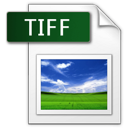
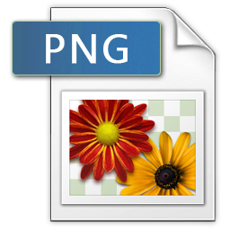
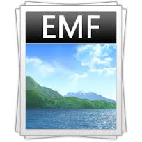
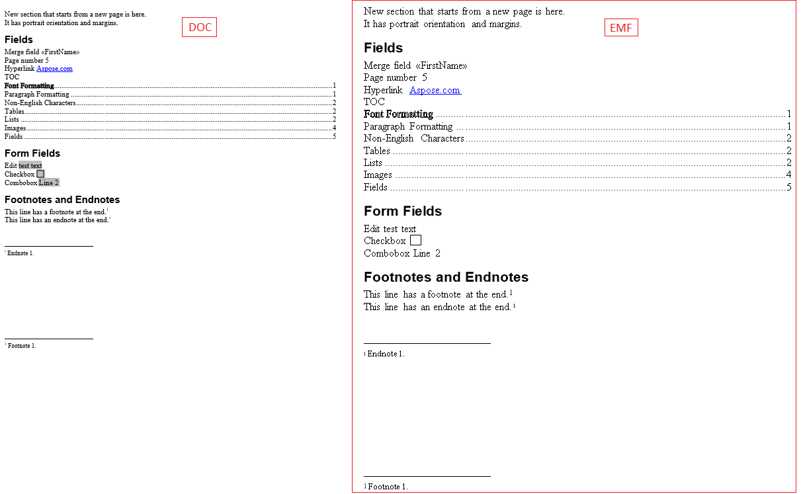
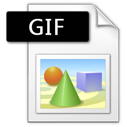

{} 

You can check the quality of Aspose.Words conversion and view the results online at this link:

<https://products.aspose.app/words/conversion>

{} 

## **About TIFF (Tagged Image File Format)**

||
[TIFF ](https://docs.fileformat.com/image/tiff/)- Tagged Image File Format - is a file format for storing raster graphics images. The TIFF format is widely supported by scanning, faxing, word processing, optical character recognition, image manipulation, desktop publishing and page layout applications.

TIFF is a flexible, adaptable file format for handling images and data within a single file, by including the header tags (size, definition, image-data arrangement, applied image compression) defining the image's geometry.
|
| :- | :- |
### **TIFF in Aspose.Words**
With Aspose.Words you can easily render any page or pages of the document and save them into a single-page or multi-page TIFF. All pages rendered by Aspose.Words to the TIFF format are shown side by side below. In the actual file, each page of the document is rendered to one frame in the TIFF file. ImageSaveOptions class can be used to specify additional options when saving a document into the TIFF format. Please refer to the following article for more details and examples:

[How to Save Document as a Multipage TIFF](/words/net/rendering/#rendering-howtosavedocumentasamultipagetiff)
## **About PNG (Portable Network Graphics)**

||[PNG ](https://docs.fileformat.com/image/png/)- Portable Network Graphics - is a raster graphics file format that supports lossless data compression. PNG was created as an improved, non-patented replacement for Graphics Interchange Format (GIF), and is the most widely used lossless image compression format on the Internet. PNG was designed for transferring images on the Internet, not for professional-quality print graphics, and therefore does not support non-RGB color spaces such as CMYK. A PNG file contains a single image in an extensible structure of "chunks", encoding the basic pixels and other information such as textual comments and integrity checks.|
| :- | :- |
### **PNG in Aspose.Words**
With Aspose.Words you can easily render a page of the document and save it as a PNG image. The ImageSaveOptions class allows you to specify a variety of options which control how the image is rendered. For example, ImageSaveOptions.HorizontalResolution and ImageSaveOptions.VerticalResolution are used to set and get the horizontal and vertical resolution for the generated image. The following code example shows how to set these properties for the generated image.

How to Save Document's Page to Image with Horizontal and Vertical Resolution

**The images show the high degree of fidelity with which Aspose.Words has converted a document from DOC to PNG.**

## **About BMP (Bitmap Image File)**

||
The [BMP ](https://docs.fileformat.com/image/bmp/)file format, also known as bitmap image file or simply a bitmap, is a raster graphics image file format used to store bitmap digital images, independently of the display device.

The [BMP ](https://docs.fileformat.com/image/bmp/)file format is capable of storing two-dimensional digital images both monochrome and color, in various color depths, and optionally with data compression, alpha channels, and color profiles..
|
| :- | :- |
### **BMP in Aspose.Words**
With Aspose.Words you can easily render a page of the document and save it as a BMP image.
ImageSaveOptions class can be used to specify additional options when saving a document into the BMP format.

**The images show the high degree of fidelity with which Aspose.Words has converted a document from DOC to BMP.**

## **About EMF (Enhanced Metafile Format)**

||[EMF ](https://docs.fileformat.com/image/emf/)-  Enhanced Metafile Format - is a file format that can store device-independent representations of graphics images. An EMF metafile can be parsed and processed to render the stored image on any output device.|
| :- | :- |
### **EMF in Aspose.Words**
With Aspose.Words you can easily render a page of the document and save it as a vector EMF file.
ImageSaveOptions class can be used to specify additional options when saving a document into the EMF format.

**The images show the high degree of fidelity with which Aspose.Words has converted a document from DOC to EMF.**

## **About JPEG (Joint Photographic Experts Group)**

||[JPEG ](https://docs.fileformat.com/image/jpeg/)stands for Joint Photographic Experts Group. It is a standard method of compressing photographic images. And JPEG file format it is image format which employs this compression. The JPEG compression algorithm is at its best on photographs and paintings of realistic scenes with smooth variations of tone and color. For web usage, where the amount of data used for an image is important, JPEG is very popular. JPEG is also the most common format saved by digital cameras.|
| :- | :- |
### **JPEG in Aspose.Words**
With Aspose.Words you can easily render a page of the document and save it as a JPEG image file.
ImageSaveOptions class can be used to specify additional options when saving a document into the Jpeg format.

**The images show the high degree of fidelity with which Aspose.Words has converted a document from DOC to JPEG.**

## **About GIF (Graphics Interchange Format)**

||[Gif ](https://docs.fileformat.com/image/gif/)- Graphics Interchange Format - is a bitmap image format that which supports up to 8 bits per pixel for each image, allowing a single image to reference its own palette of up to 256 different colors chosen from the 24-bit RGB color space. It also supports animations and allows a separate palette of up to 256 colors for each frame. These palette limitations make the GIF format less suitable for reproducing color photographs and other images with continuous color, but it is well-suited for simpler images such as graphics or logos with solid areas of color..|
| :- | :- |
### **GIF in Aspose.Words**
With Aspose.Words you can easily render a page of the document and save it as a Gif image

**The images show the high degree of fidelity with which Aspose.Words has converted a document from DOCX to GIF.**

