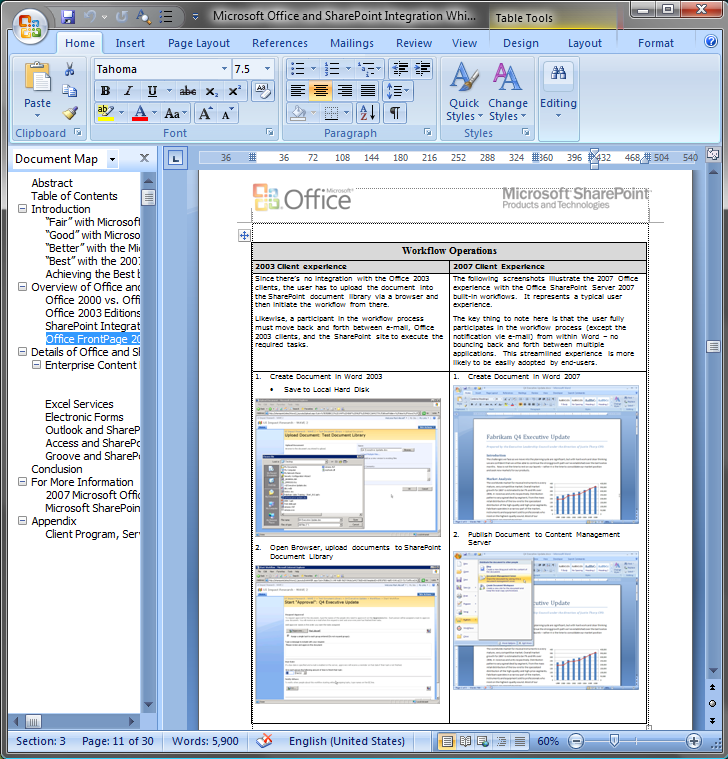

{} 

You can check the quality of Aspose.Words conversion and view the results online at this link:

<https://products.aspose.app/words/conversion>

{} 

## **About Word processingML**

||WordprocessingML or WordML is a name for a family of XML-based formats for word processing documents.   WordprocessingML was first introduced in Microsoft Word 2003. WordprocessingML was a significant step by Microsoft towards making the document format open. It is plain XML format.   [Office Open XML](http://en.wikipedia.org/wiki/Office_Open_XML) (OOXML) is the new XML-based format introduced in Microsoft Office 2007 applications. Office Open XML is a container format for several specialized XML-based markup languages. WordprocessingML is the markup language used by Microsoft Office Word to store its [DOCX](https://docs.fileformat.com/word-processing/docx/)documents.|
| :- | :- |
## **WordprocessingML in Aspose.Words**
This table explains which “versions" of WordprocessingML are supported by Aspose.Words for .NET:

|**WordprocessingML “Version”**|**Applicable Standard/Specification**|**Supported**|
| :- | :- | :- |
|Microsoft Word 2003|[Microsoft Word 2003 XML](http://en.wikipedia.org/wiki/Microsoft_Office_XML_formats)|Yes|
|Microsoft Word 2007|[OOXML ECMA-376](http://www.ecma-international.org/publications/standards/Ecma-376.htm)|Yes|
|Microsoft Word 2010|OOXML ISO /IEC DIS 29500|Yes|
|Microsoft Word 2013|DOCX extensions spec [MS-DOCX] Drawing ML extension spec [MS-ODRAWXML] A few elements/attributes from [ISO/IEC 29500-1:2012] which were previously unsupported in Word 2010|Yes|
|Microsoft Word 2016|DOCX extensions spec [MS-DOCX]  Drawing ML extension spec [MS-ODRAWXML] v2017-02-02 Elements/attributes from [ISO/IEC 29500-1/4:2012]|Yes|

OOXML WordprocessingML documents most often come as DOCX files, which are ZIP packages. In addition to DOCX, Aspose.Words also supports loading and saving OOXML in the “plain XML” [FlatOPC](http://blogs.msdn.com/ericwhite/archive/2008/09/29/the-flat-opc-format.aspx) format. 

Aspose.Words provides extensive support for loading, saving and converting WordprocessingML documents. Such all-embracing implementation is possible because of Aspose.Words API was designed with the structure of Microsoft Word documents in mind (and WordprocessingML is known to mimic the internal representation of Microsoft Word documents).

**A DOCX document generated by Aspose.Words and opened in Microsoft Word.**

**A DOCX document generated by Aspose.Words follows the Open Packaging Convention and can be opened in a ZIP-capable application.**! WordprocessingML (DOCX, XML)-003.png|border=0!
## **OOXML is Open, Why Use Aspose.Words?**
Being XML-based, Office Open XML is heralded as an enabling technology. It is true that Office Open XML makes it possible to build document processing and generating applications using just the XML classes without relying on third-party libraries such as Aspose.Words.  However, we strongly believe it is still very beneficial to use Aspose.Words when you have to deal with OOXML documents, rather than work through XML or other libraries. 

The OOXML specification is several thousand pages long. Being open and standard does not mean being simple. To correctly process or generate OOXML documents one must invest in learning the format well.

In addition to making it simpler to correctly process and generate valid documents, Aspose.Words provides the following important features you would not have when working with OOXML files directly via XML or other third-party libraries:

- Quality conversions between many popular document formats, including conversion to PDF, XPS and printing.
- Ability to build documents from fragments from one or multiple documents, while automatically merging per-document structures such as styles and lists.
- High-level functions such as field update, accept revisions or mail merge can be invoked with just one line of code.
- Access to flat Range-like operations such as find and replace, get/set the text of a bookmark, form field, document field or a node.

Consider the following example. It is a simple paragraph that contains the text “Hello World” and the word “Hello” is bold. Now imagine you need to write a program that will search for all “Hello World” phrases in the document and replace them with “Goodbye Earth”.

What started out as a seemingly simple task of loading, modifying and saving an XML file does not look so simple anymore. In fact, it has become very complex. It takes a non-trivial algorithm to find and replace flat text across an XML tree. Have you ever wondered why standard XML classes such as **XmlDocument** do not offer to find and replace functionality?

**A fragment of an Office Open XML document.**

**XML**



 <w:p w:rsidR="00C07F31" w:rsidRDefault="003F6D7A">

<w:r w:rsidRPr="003F6D7A">

<w:rPr>

<w:b />

</w:rPr>

<w:t>Hello</w:t>

</w:r>

<w:r>

<w:t xml:space="preserve">World.</w:t>

</w:r>

</w:p>



Implementing even a simple find and replace operation over an Office Open XML document yourself is far from easy. It might be that your boss will enjoy you coding this yourself, but maybe not. Our advice: remember that open and standard does not mean simple and use Aspose.Words.

