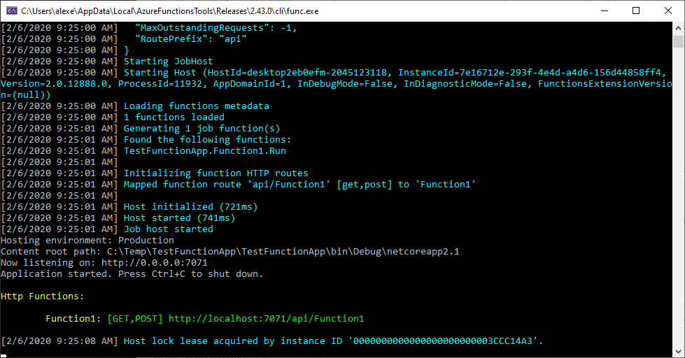

Conversion of documents with images to fixed page formats using Aspose.Words in Azure Functions does not work properly at deployment to Azure, having images not retained. However, such a conversion works properly on a local machine. The reason behind this problem is that SkiaSharp native assets are not properly published. The issue is reported to Azure in [Github](https://github.com/Azure/Azure-Functions/issues/622).

In order to resolve the problem, you can add the following section in the .csproj file that makes native assets copied properly:



 <Target Name="CopyRequiredNativeAssets" AfterTargets="_FunctionsPostPublish">

  <ItemGroup>

    <NativeAssetToCopy Include="$(PublishDir)runtimes\win-x86\native\libSkiaSharp.dll" />

  </ItemGroup>

  <Copy SourceFiles="@(NativeAssetToCopy)" DestinationFolder="$(PublishDir)bin" />

</Target>



The following example shows how to use Aspose.Words in Azure Function with the details on how to add the code above.
## **Prerequisites**
- Active Azure subscription. If you don't have one, create a free account before you begin.
- Visual Studio 2019 or Visual Studio 2017 with the latest installed Azure Functions tools to create the project.
## **Creating an Azure Functions Application**
You need to use Visual Studio to create an Azure Functions Application. The created application already has a simple “Hello World” function code.

In this example, you create a simple “Hello World” document and return it to the user's browser as a PDF file. To accomplish this:

1. Start creating a function using Aspose.Words by adding a NuGet reference to the latest version of [Aspose.Words](https://www.nuget.org/packages/Aspose.Words/). Then modify the code as follows:



 using System.IO;

using System.Threading.Tasks;

using Microsoft.AspNetCore.Mvc;

using Microsoft.Azure.WebJobs;

using Microsoft.Azure.WebJobs.Extensions.Http;

using Microsoft.AspNetCore.Http;

using Microsoft.Extensions.Logging;

using Aspose.Words;

namespace AsposeWordsAzureTestApp

{

    public static class CreateTestDocument

    {

        [FunctionName("CreateTestDocument")]

        public static async Task<IActionResult> Run(

            [HttpTrigger(AuthorizationLevel.Anonymous, "get", "post", Route = null)] HttpRequest req,

            ILogger log)

        {

            log.LogInformation("C# HTTP trigger function processed a request.");

            // Create a simple document using DocumentBuilder.

            Document doc = new Document();

            DocumentBuilder builder = new DocumentBuilder(doc);

            // Write some text in the document.

            builder.Writeln("Hello Aspose.Words!");

            // Write OS we are running on.

            builder.Writeln("You are running on " + System.Environment.OSVersion.VersionString);

            // Insert some image into the document.

            builder.InsertImage(@"https://cms.admin.containerize.com/templates/aspose/App_Themes/V3/images/aspose-logo.png");

            // Now save the created document to PDF and return as a FileContentResult.

            using (MemoryStream ms = new MemoryStream())

            {

                doc.Save(ms, SaveFormat.Pdf);

                return new FileContentResult(ms.ToArray(), "application/pdf")

                {

                    FileDownloadName = "out.pdf"

                };

            }

        }

    }

}



1. Run the code in Visual Studio to test it. The result will be displayed in the console output.
1. 
1. Copy URL from the console output to your favorite browser to get the output document, which should look as follows:

1. Now, if you [deploy the created function to Azure](https://docs.microsoft.com/en-us/azure/azure-functions/functions-create-your-first-function-visual-studio#publish-the-project-to-azure), the image will not be rendered because of the problem stated at the beginning of this article. The output is shown below:

1. Open the .csproj file in Notepad and add the following section to it:



 <Target Name="CopyRequiredNativeAssets" AfterTargets="_FunctionsPostPublish">

  <ItemGroup>

    <NativeAssetToCopy Include="$(PublishDir)runtimes\win-x86\native\libSkiaSharp.dll" />

  </ItemGroup>

  <Copy SourceFiles="@(NativeAssetToCopy)" DestinationFolder="$(PublishDir)bin" />

</Target>



1. Publish your project again and verify that the image is now present in the generated output.
## **See Also**
- Active [Microsoft Azure subscription](https://docs.microsoft.com/en-us/azure/guides/developer/azure-developer-guide#understanding-accounts-subscriptions-and-billing).
- Create a [free account](https://azure.microsoft.com/free/?ref=microsoft.com&utm_source=microsoft.com&utm_medium=docs&utm_campaign=visualstudio) in Microsoft Azure.
- Install [the latest Azure Functions tools](https://docs.microsoft.com/en-us/azure/azure-functions/functions-develop-vs#check-your-tools-version) to create the project in Visual Studio 2017.
- Use Visual Studio to [create an Azure Functions Application](https://docs.microsoft.com/en-us/azure/azure-functions/functions-create-your-first-function-visual-studio).
